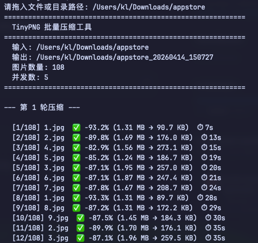

# 图片批量压缩工具

批量压缩 PNG / JPG / JPEG / WebP 图片，提供两套方案：

- `tinypng.py` — 走 TinyPNG Web API，云端压缩，效果稳。
- `tinypng_local.py` — 纯本地压缩（mozjpeg / pngquant / oxipng / cwebp），零网络、秒级完成，可选降采样。

压缩结果输出到同级目录下的 `<原名>_<时间戳>` / `<原名>_<时间戳>_local` 文件夹，目录结构保持不变。

## 使用方法

### 云端版（TinyPNG API）

```bash
python3 tinypng.py <文件或目录路径>
# 或直接运行后拖入路径
python3 tinypng.py
```

特性：

- 支持 PNG、JPG、JPEG、WebP
- 多线程并发压缩
- 失败自动重试，直到全部成功
- 保留原始目录结构，实时显示进度与压缩率

依赖：Python 3.10+、`requests`

```bash
pip install requests
```

### 本地版（零云端）

```bash
python3 tinypng_local.py <文件或目录路径> [--resize N]
```

- `--resize N`：图片最大边超过 N 像素时先等比降采样到 N，再做编码层压缩；默认不降采样。
- 压缩策略：
  - `.jpg` / `.jpeg` → `mozjpeg` (djpeg | cjpeg -quality 80 -optimize -progressive)
  - `.png` → `pngquant --quality=65-80`，再 `oxipng -o 4`
  - `.webp` → `cwebp -q 80`
- 压后反而变大时自动回退到原图，保证不劣化。

依赖（首次使用需 brew 安装）：

```bash
brew install mozjpeg pngquant oxipng webp
# 启用 --resize 时额外需要 Pillow（脚本会自动尝试安装）
pip install Pillow
```

## 预览



## License

MIT
